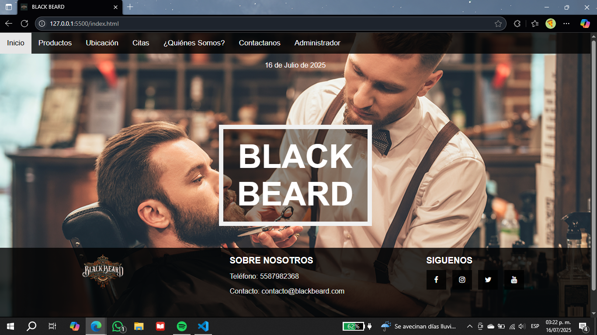
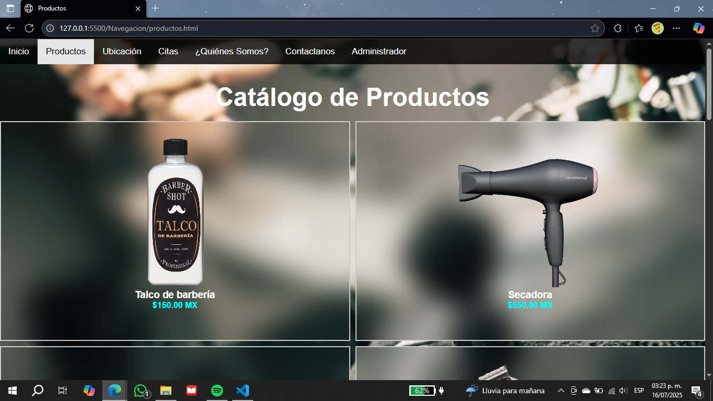
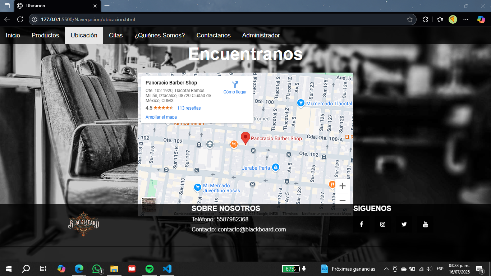
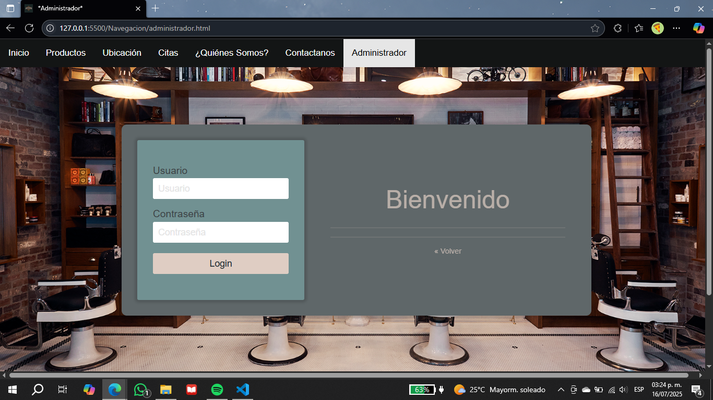

# 💈 BLACK BEARD – Barbería
Sitio web desarrollado como proyecto final para la materia de Programación Web. Representa una barbería ficticia con enfoque en e-commerce, montado y probado en servidor remoto durante su entrega.

--- 

## 🛠️ Tecnologías utilizadas
- HTML
- CSS

---

## 📂 Estructura del proyecto
```
Barberia/
├── index.html
├── estilos/
├── imagenes/
├── Navegacion/
│   ├── administrador.html
│   ├── citas.html
│   ├── contactanos.html
│   ├── productos.html
│   ├── quienessomos.html
│   └── ubicacion.html

```

---

## 🧭 Secciones del sitio

- **Inicio** – Página principal.  
- **Productos** – Servicios y artículos disponibles.  
- **Ubicación** – Dirección y mapa de la barbería.  
- **Contáctanos** – Formulario de contacto.  
- **Citas** – Gestión de turnos.  
- **Quiénes somos** – Información sobre la empresa.  
- **Administrador** – Área interna del sistema.  

---

## 📸 Capturas del sitio

### 🏠 Inicio  


### 🛒 Productos  


### 📍 Ubicación  


### 🔐 Administrador  


---

## 🚀 ¿Cómo ejecutarlo?

1. Clona o descarga el repositorio.
   `git clone https://github.com/DanielChagoya/BlackBeard.git` 
2. Abre `index.html` en tu navegador o usa Live Server desde VS Code.

---

## 👨‍💻 Autor
**Daniel Chagoya**  
Desarrollador de Software | Ingeniero en Sistemas Computacionales  
[LinkedIn](https://www.linkedin.com/in/daniel-chagoya-58638b321/)


---

## 👥 Créditos adicionales
- Fernando Méndez Ruiz
- Cruz Quiroz Mariana
- Rojas González Jorge

---

## 📄 Licencia

Este proyecto está bajo la Licencia MIT.

---
